# advent-of-code

My Advent of Code solutions for the year 2022.

<!-- AOC TILES BEGIN -->
<h1 align="center">
  2022 - 30 ⭐
</h1>

<a href="2022/09/09.kt">
  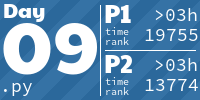
</a>

<a href="2022/11/11.kt">
  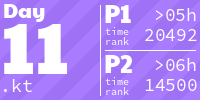
</a>
<a href="2022/12/12.kt">
  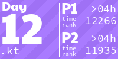
</a>
<a href="2022/13/13.kt">
  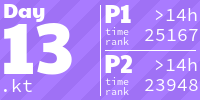
</a>
<a href="2022/14/14.kt">
  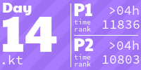
</a>
<a href="2022/15/15_2.kt">
  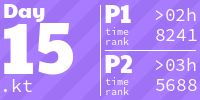
</a>

<a href="None">
  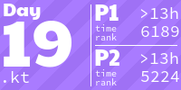
</a>
<a href="None">
  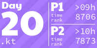
</a>
<a href="None">
  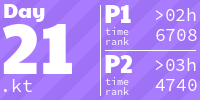
</a>
<a href="None">
  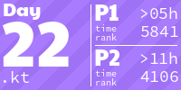
</a>
<a href="None">
  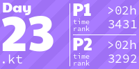
</a>
<a href="None">
  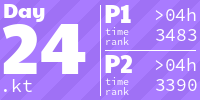
</a>
<a href="None">
  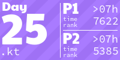
</a>
<!-- AOC TILES END -->
